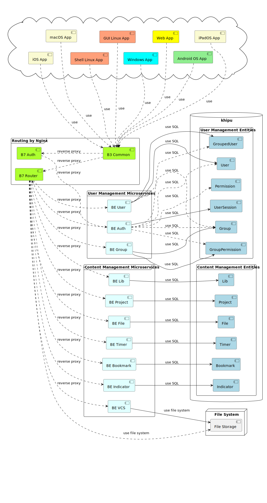

# Khipu API

Backend for Khipu App clients (Web, Windows, GUI, Shell, macOS, iOS, iPadOS, Android apps) based on microservice architecture. Nginx is used as basic router. Each microservice make a set of operation is dialing with one type of following operations:

- `auth` is microservice for authorization / authentication;
- `user` is microservice for using of users;
- `group` is microservice for using of user groups;
- `lib` is microservice for using of libraries;
- `project` is microservice for using of projects;
- `file` is microservice for using of files;
- `vcs` is microservice for using of version control system based on [Git](https://git-scm.com/);
- `timer` is microservice for using of user's times;
- `bookmark` is microservice for using of user's bookmarks;
- `indicator` is microservice for using of user's indicators.

Common scheme of microservices routing as components shows on following picture:

